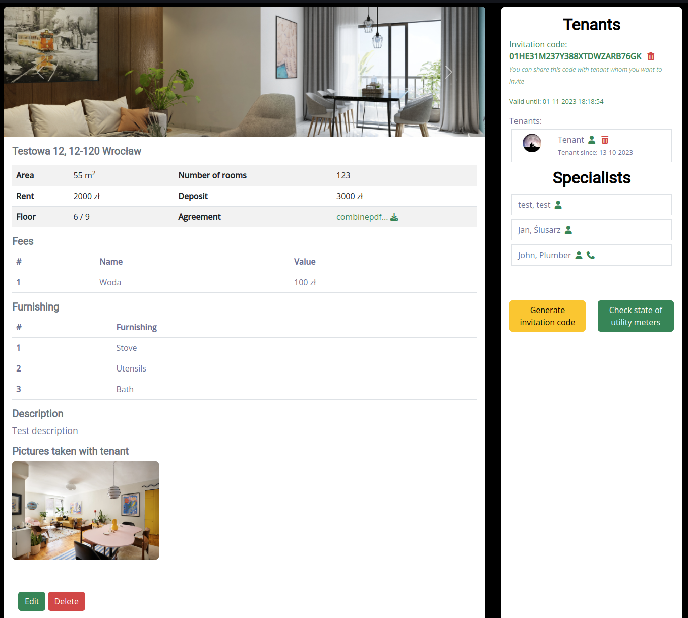

# Flatapp
Flatapp is an app made for managing flat renting.

## Technologies
+ PHP - Symfony
+ CSS - Bootstrap
+ jQuery
+ Docker - Docker-compose
+ MariaDB
+ Nginx
+ PHPUnit
+ [Ratchet](https://github.com/ratchetphp/Ratchet)
## Features
+ Registering as Tenant or Landlord
  
+ Adding flats - multi-step form
  
  
  
  
  
+ Inviting new tenants with invitation code (in Base58)
  
+ Live chat for all related users (for example, if John is Andrew's tenant, they can send messages to each other, and so can Andrew to all of his tenants)
  
+ Managing profile

+ Adding new utility meters readings (as tenant)
  
+ Adding utility meters costs (as landlord)


+ Adding new specialists
  

+ Flat summary
  
+ Adding tasks to small Todo-app on dashboard (stored in DB, can be sorted and marked as done)
  
## Testing
Tests can be found at tests/, it is recommended to run them with -d parameter:
```
php bin/phpunit -d memory_limit=-1
```